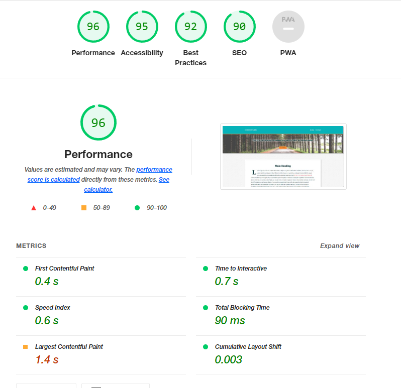

# m7-hw7-christensen-kristine
Assignment 7: Use CSS Positioning, Pseudo-Elements, and Pseudo-Classes to Create Tooltips
## About This Assignment ##
This assignment required that we: 
1. Use the position:sticky to make the section.hero stick to the top of the page
2. Create a drop cap for hte first leter of the first p tag in the article element
3. Finish the tooltip code in CSS
4. Deploy the finished site to GitHub pages

## Lighthouse Report ##
